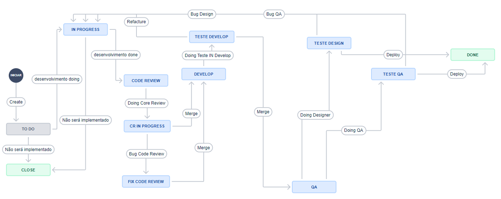
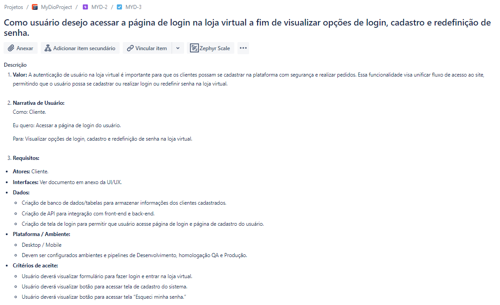
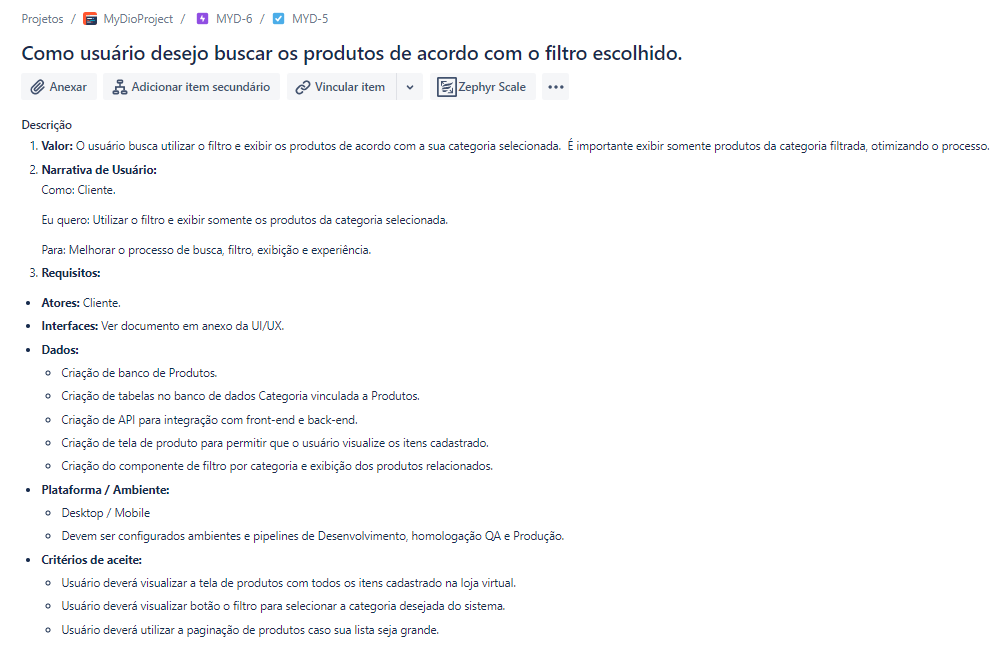
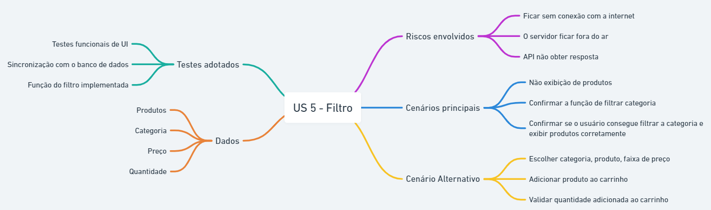
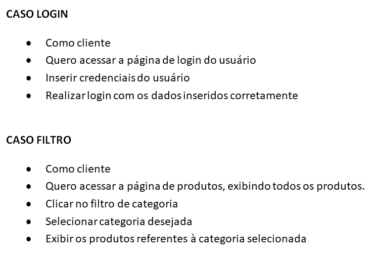
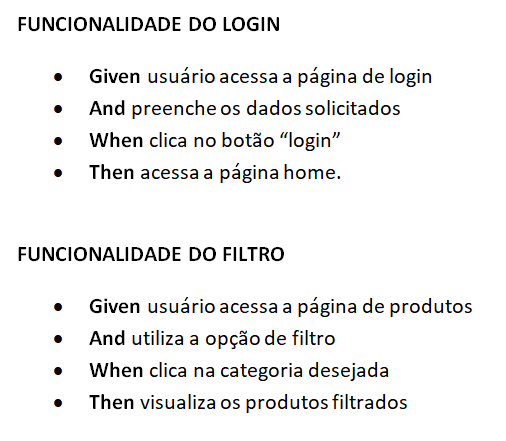

# Bootcamp de QA - DIO & GFT
O dia a dia de um QA: A prática de testes manuais funcionais

## 📝 Desafios entregues
Nosso projeto é o [saucedemo.com](https://www.saucedemo.com/), para seguir como exemplo base para o planejamento. 

## 1️⃣ Desafio - Fluxo de Trabalho

## 2️⃣ Desafio - User Stories
### 1º User Storie:

### 2º User Storie:

## 3️⃣ Desafio - Mind Map:

## 4️⃣ Desafio - Step By Step:

## 5️⃣ Desafio - BDD Gerkin:

## O papel do QA em uma planning.
- Verificar se as User Stories estão com escopo viável;
- Verificar que as histórias podem ser verificadas e validadas dentro do período correto;
- Analisar junto aos devs a complexidade da história sem comprometer a qualidade;
- Os QAs também participam do planning poker.

## 💬 &nbsp;Contact

Feito por [Raissa Curty](https://github.com/curtyraissa)!

